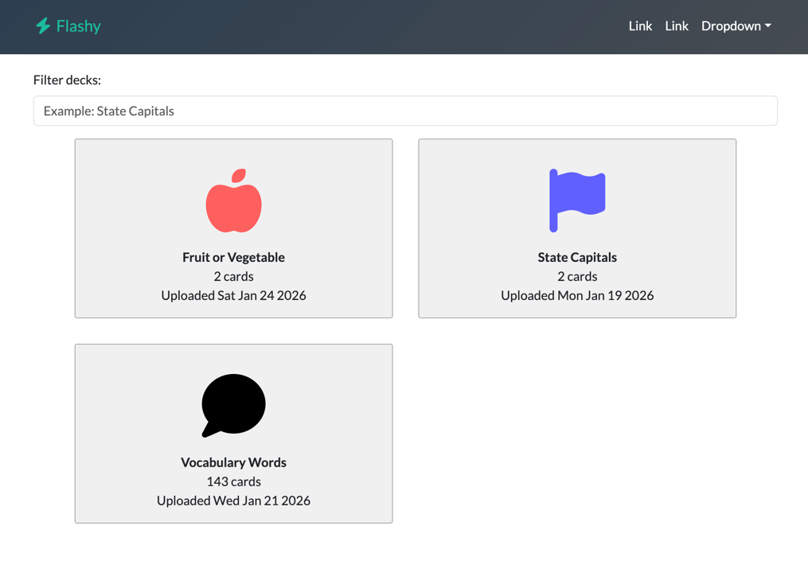
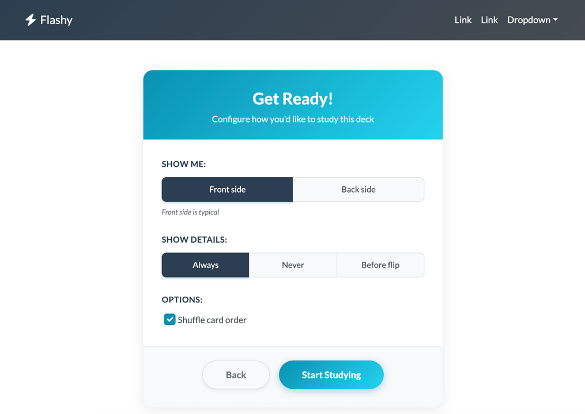
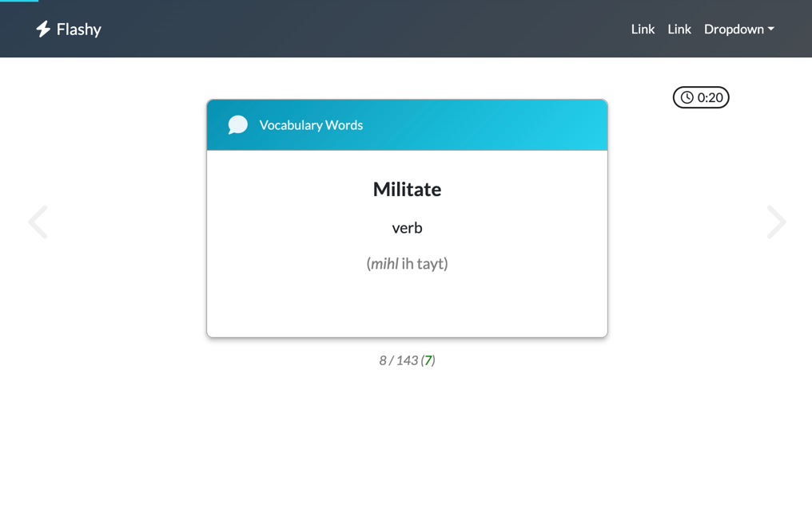
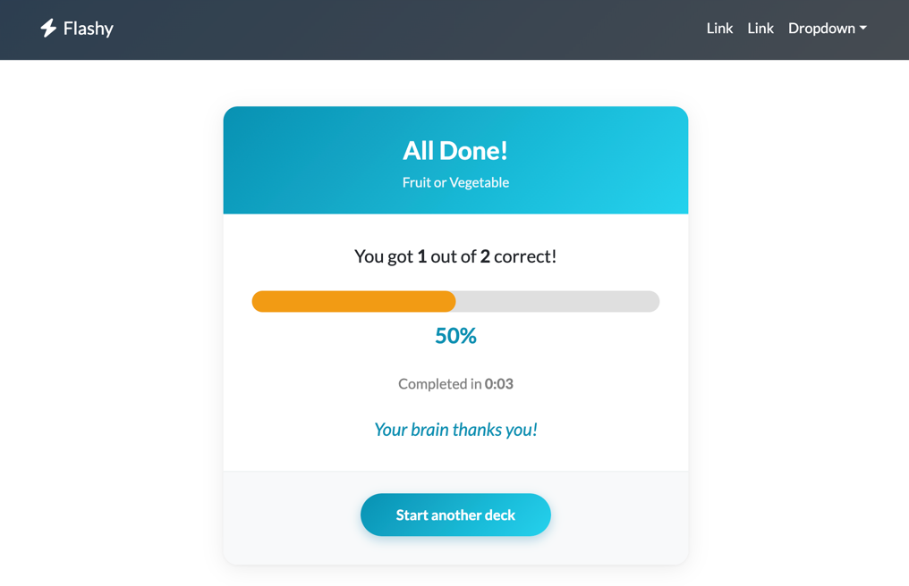

# getflashy - Source code for getflashy.io


[](https://codecov.io/gh/bobbylight/getflashy.io)

`getflashy` is a flash card webapp. I'm building it to learn
trendy new web technologies while memorizing a bunch of words.

## Screenshots
**Note:** Screenshots may be wildly out of date!

|          |  |
|------------------------------------------| --- |
| <p align="center">**Picking a deck**</p> | <p align="center">**Configuring the session**</p> |

|  |   |
|--------------------------------------| --- |
| **Going through the deck**               | **Viewing the results**               |

## Hacking
`getflashy` is written in TypeScript. It's built
with vite, which makes developing super-easy. First, install
all node modules and start an express server (port 8080 by default;
configurable via $PORT environment variable):

```js
nvm use
npm install
npm run start
```

Then, in another window, build and watch the UI components in
dev mode so changes are immediately visible in your browser
after a refresh:

```js
npm run dev
```

### How it works
vite serves the frontend from http://localhost:5473 and proxies API
calls to http://localhost:8080.

